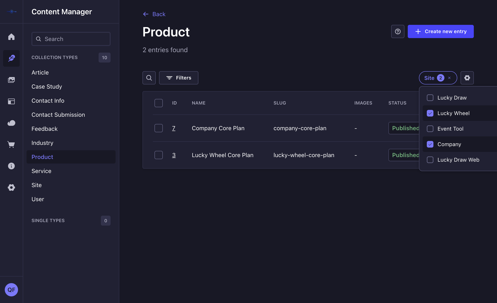

# strapi-plugin-quick-filters

**One-click filter dropdowns for the Strapi Content Manager — no more Filters
popover gymnastics.**



## The problem

Strapi's built-in filter is powerful but slow for the most common case: *"show me
only the rows where this relation/enum is X."* Every time, it's the same dance:

1. Click **Filters**
2. Pick the field from a dropdown
3. Pick an operator (`is`, `is not`, `contains`, ...)
4. Type or pick the value
5. Click **Apply**

Four clicks and a dropdown hunt, for something that should be one click.

## The fix

**Quick Filters** renders a compact dropdown — one per configured field — right
next to the **Filters** button. Click it, tick the values you want, the list
re-filters instantly. The trigger shows a badge with how many are selected and an
✕ to clear in one click. No popover, no operator picking, no typing.

- 🎯 **Single or multi-select** per field — a radio-style dropdown for "pick one,"
  checkboxes for "pick several"
- 🧩 **Fully custom UI, not the default design-system look** — a purpose-built
  dropdown (trigger + badge + panel + checkboxes) styled from Strapi's own design
  tokens (`theme.colors`, `theme.shadows`), so it matches light/dark admin themes
  without looking like a stock component
- 📈 **Scales to dozens of options** — a single compact trigger instead of one
  button per value, with an automatic search box once a field has more than 8
  options. Adding a 20th site tomorrow doesn't turn the toolbar into a wall of
  buttons.
- 🧠 **Zero per-content-type wiring** — configure the relation field *once*, and
  every content-type that has it gets the dropdown automatically. Add a new
  content-type with the same relation next month and it just works, no code
  change.
- ⚡ **Native Content Manager filtering under the hood** — selections just set the
  same `filters` query param the built-in Filters UI uses, so pagination, sorting,
  and every other list-view feature keep working normally.
- 🔁 **Built to hold many independent filters** — the config takes an array, so a
  project that eventually needs a "Language" dropdown, a "Status" dropdown, and a
  "Category" dropdown alongside "Site" just adds more entries; each one gets its
  own dropdown, resolved independently per content-type.

Built for and battle-tested in production on a real multi-site Strapi CMS (filtering
articles/products/services/... by which client site they belong to, across 8+
content-types).

## Installation

### Option A — local monorepo dependency

If the plugin lives as a sibling folder to your Strapi app:

```json
// package.json
"dependencies": {
  "strapi-plugin-quick-filters": "file:../strapi-plugin-quick-filters"
}
```

```bash
npm install
```

### Option B — vendored tarball (recommended for Docker/production builds)

`file:../sibling-folder` dependencies break in a Docker build, because the build
context usually only includes your app's own folder — the sibling plugin folder
simply isn't there to resolve. Vendor a tarball inside your app instead:

```bash
# inside this plugin's folder
npm run build
npm pack

# copy the resulting .tgz into your Strapi app
mkdir -p /path/to/your-app/vendor
cp strapi-plugin-quick-filters-*.tgz /path/to/your-app/vendor/
```

```json
// your-app/package.json
"dependencies": {
  "strapi-plugin-quick-filters": "file:./vendor/strapi-plugin-quick-filters-<version>.tgz"
}
```

```bash
npm install
```

If your `Dockerfile` runs `npm ci` before copying the full source tree (a common
pattern for Docker layer caching), make sure `vendor/` is copied in **before** that
`npm ci` step, in every stage that runs `npm ci`:

```dockerfile
COPY package*.json ./
COPY vendor ./vendor   # <-- must exist before npm ci resolves the tarball path
RUN npm ci
```

Every time you change the plugin's code, bump its `version` in `package.json`,
re-run `npm run build && npm pack`, replace the `.tgz` in `vendor/`, update the
version in the host app's `package.json`, and `npm install` again — npm caches
`file:` tarball dependencies aggressively by path+version, so reusing the same
filename after a code change can silently keep the old build installed.

## Configuration

In your Strapi app's `config/plugins.ts` (or `.js`):

```ts
export default () => ({
  'quick-filters': {
    enabled: true,
    config: {
      filters: [
        {
          field: 'site',               // the relation attribute name on your content-types
          targetUid: 'api::site.site', // the content-type it relates to
          labelField: 'name',          // which field of the target to show as the option label
          label: 'Site',               // text on the dropdown trigger — defaults to `field`
          mode: 'multi',                // 'multi' = checkboxes, 'single' = radio dropdown
        },
        // add as many filter definitions as you need — each gets its own dropdown
        // and applies to every content-type whose schema has a matching relation
      ],
    },
  },
});
```

That's it. No further per-content-type setup — every content-type with a `site`
relation targeting `api::site.site` gets the dropdown automatically, on both
existing and future content-types. Need a second, unrelated filter (say, a
`language` relation)? Add a second object to the `filters` array — it resolves and
renders completely independently of the first.

## How it works

- Registers into the Content Manager's `listView.actions` injection zone (the space
  between the **Filters** button and the view-configuration gear icon).
- A small admin-only server route (`GET /quick-filters/resolve?model=...`) checks the
  requested content-type's schema against your config and returns the matching
  filter definitions plus the live list of options (id + label) from the target
  content-type.
- The dropdown is a small custom React component (trigger + portal-free absolute
  panel + checkbox/radio list), styled with `styled-components` reading directly
  from the Strapi admin's own theme object — no dependency on `@strapi/design-system`
  components for the visual layer, only for layout primitives (`Flex`).
- Selecting a value writes straight to the URL's `filters` query param — the exact
  mechanism the Content Manager's own list view already uses — so the list refetches
  through the normal, native filtering path.

## Requirements

- Strapi `^5.0.0`
- React 18, React Router 6, styled-components 6, `@strapi/design-system` and
  `@strapi/icons` (all already provided by the Strapi admin panel — just make sure
  they're listed as `peerDependencies` if you fork this, not bundled, or you'll end
  up with a duplicate React context tree and broken click handlers)

## License

MIT
